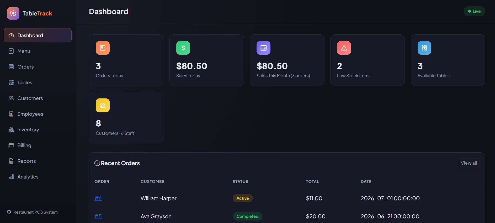
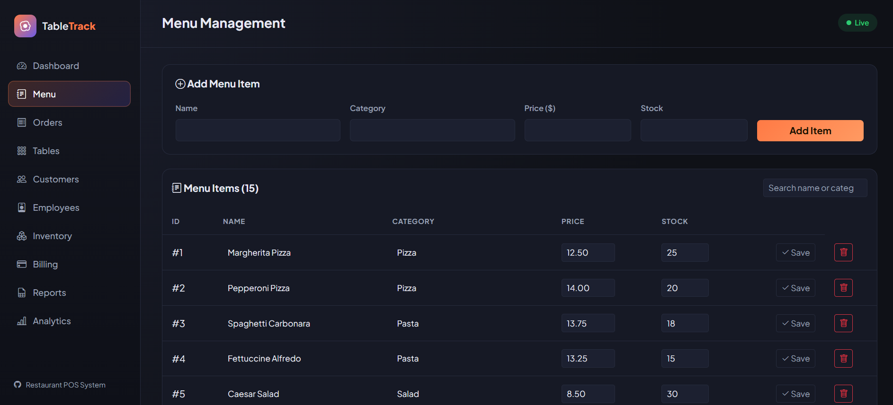
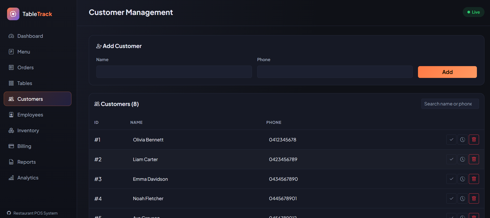
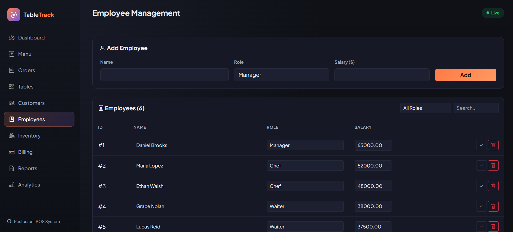
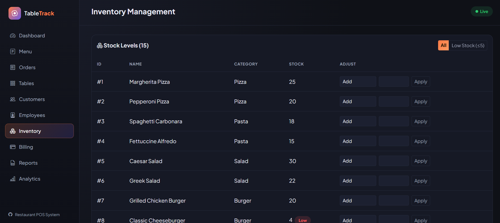
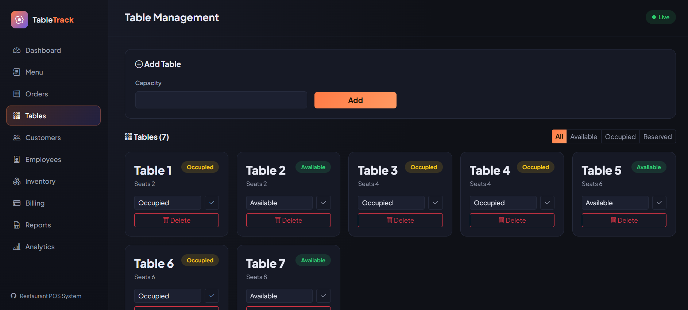
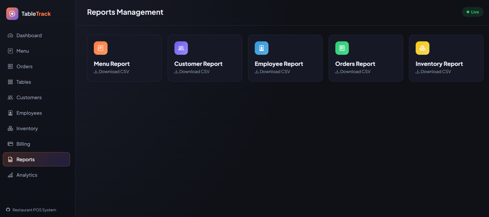
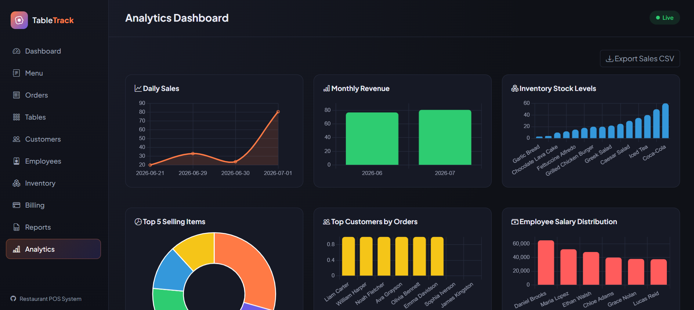

# 🍽️ TableTrack

A Restaurant Point of Sale (POS) System built with **Python**, **Flask**, and **PostgreSQL** — featuring a polished web dashboard UI and the original CLI mode, designed to manage all core restaurant operations: orders, billing, tables, inventory, staff, and live analytics.


---

## 👤 Author

| Field | Details |
|---|---|
| **Name** | Pratiksha Dilip Kamble |
| **Student ID** | 541015583 |
| **Tutorial** | 15 |
| **Tutor** | Abbey Lin |
| **Date** | April 24, 2026 |

---

## 📋 Overview

TableTrack simulates real-world restaurant workflows end to end: order processing, billing, inventory tracking, customer management, employee management, table management, and analytics — all backed by a PostgreSQL database.

It ships with **two interfaces** over the same database:

- **Web UI** (`app.py`) — a Flask app with a dark, dashboard-style interface: sidebar navigation, live stat cards, inline editing, an order builder, a printable bill/receipt view, CSV report downloads, and a Chart.js analytics dashboard.
- **CLI** (`main.py`) — the original terminal-based menu system, kept fully functional for direct database scripting / coursework requirements.

---

## 🎯 Objectives

1. Build a fully functional POS system with both a CLI and a web interface
2. Implement database operations using PostgreSQL
3. Apply programming concepts (OOP, loops, conditionals, functions, MVC-style routing)
4. Simulate real-world restaurant workflows
5. Ensure efficient, structured, and secure data handling (parameterised queries, pooled connections, no secrets in source control)

---

## 🛠️ Technologies Used

| Technology | Purpose |
|---|---|
| Python | Core programming language |
| Flask | Web framework powering the dashboard UI |
| Jinja2 + Bootstrap 5 | Server-rendered templates and styling |
| Chart.js | Interactive analytics charts in the browser |
| PostgreSQL | Persistent data storage |
| psycopg2 (pooled) | Python–PostgreSQL database connector |
| python-dotenv | Loads DB credentials from a local `.env` file |
| matplotlib / pandas | Analytics graphs and CSV export (CLI mode) |

---

## 📁 Project Structure

```
TableTrack/
│
├── app.py            # Flask web app — routes, dashboard, analytics API
├── main.py           # CLI entry point — terminal main menu
├── db.py             # Database connection pool (shared by web + CLI)
├── menu.py           # Menu item management (CLI)
├── customer.py       # Customer management (CLI)
├── employee.py       # Employee management (CLI)
├── inventory.py      # Inventory / stock management (CLI)
├── tables.py         # Table management (CLI)
├── order.py          # Order creation and management (CLI)
├── billing.py        # Billing, receipts, sales reports (CLI)
├── reports.py        # CSV report exports (CLI)
├── analytics.py      # matplotlib analytics graphs (CLI)
├── schema.sql        # Database schema
├── seed_data.sql     # Sample data for testing the UI
├── templates/        # Flask/Jinja2 HTML templates
│   └── base.html, dashboard.html, menu.html, ...
├── static/
│   └── css/style.css # Dashboard styling
├── Screenshots/      # UI screenshots used in this README
├── requirements.txt
├── .env.example       # Template for DB credentials
└── .gitignore
```

---

## ✨ Features

### 📊 Web Dashboard (`app.py`)
- Live stat cards: today's orders/sales, monthly revenue, low-stock count, available tables, customer/staff counts
- Recent orders feed



### 🍴 Menu Management
- Add menu items via form; inline edit name/category/price/stock directly in the table
- Search by name or category
- Low-stock badge shown inline



### 👤 Customer Management
- Add/edit/delete customers; search by name or phone
- Per-customer order history page



### 👷 Employee Management
- Add/edit/delete employees; filter by role (Manager / Chef / Waiter / Cashier); search



### 📦 Inventory Management
- View stock levels; add/reduce/set stock via quick-action form
- Filter to low-stock items (≤5)



### 🪑 Table Management
- Add tables; change status (Available / Occupied / Reserved); filter by status; delete



### 🧾 Order Management
- Visual order builder: pick customer, table, and a dynamic list of items + quantities
- Automatic stock deduction on order creation, restoration on cancellation, table status sync
- Order detail page with item breakdown; complete/cancel actions


### 💳 Billing
- Generate itemised bills with adjustable discount % and automatic 10% tax
- Download receipt as a `.txt` file
- Daily / monthly sales summary


### 📑 Reports
- One-click CSV export: Menu, Customers, Employees, Orders, Inventory



### 📈 Analytics Dashboard
- Daily sales line chart, monthly revenue bar chart, inventory stock levels, top 5 selling items, top customers by orders, employee salary distribution, order status breakdown — all live via Chart.js, backed by JSON API endpoints
- Export full sales report as CSV



*(The original CLI mode in `main.py` offers the equivalent menu-driven version of every feature above, plus matplotlib chart pop-ups in `analytics.py`.)*

---

## ⚙️ Setup & Installation

### Prerequisites
- Python 3.8+
- PostgreSQL database access
- pip

### 1. Clone and install dependencies

```bash
git clone <your-repo-url>
cd TableTrack
pip install -r requirements.txt
```

> Note: if you're on a very new Python version (3.13+) and `psycopg2-binary` fails to build, install it explicitly with:
> `pip install psycopg2-binary --only-binary=:all:`

### 2. Configure your database credentials

Copy the example env file and fill in your own values — **never commit real credentials**:

```bash
cp .env.example .env
```

```env
DB_HOST=your_host
DB_NAME=your_database
DB_USER=your_username
DB_PASSWORD=your_password
DB_PORT=5432
FLASK_SECRET_KEY=replace_with_a_random_string
```

`.env` is listed in `.gitignore` so it stays out of version control.

### 3. Create the database tables

Run `schema.sql` against your PostgreSQL database (e.g. via pgAdmin's Query Tool or `psql`):

```sql
-- See schema.sql for the full definitions of:
-- menu_items, customers, employees, restaurant_tables, orders, order_items
```

### 4. (Optional) Load sample data to test the UI

`seed_data.sql` populates realistic menu items, customers, employees, tables, and orders so every page has data to display. Run it the same way as `schema.sql`. **It truncates existing data first** — don't run it against data you want to keep.

### 5. Run the app

**Web UI:**
```bash
python app.py
```
Then open **http://127.0.0.1:5000**.

**CLI:**
```bash
python main.py
```

---

## 🖥️ CLI Main Menu

```
============================================================
         TABLETRACK
============================================================
1. Menu Management
2. Customer Management
3. Employee Management
4. Inventory Management
5. Table Management
6. Order Management
7. Billing Management
8. Reports Management
9. Analytics Dashboard
10. Exit
============================================================
```

---

## 🔄 System Flow

```
Start
  └─> Connect to Database (pooled)
        └─> Web UI: navigate via sidebar  |  CLI: display main menu
              └─> Select feature
                    └─> Read/write data via parameterised SQL
                          └─> Render dashboard / print result
```

---

## 🔒 Security Notes

- Database credentials live only in a local, gitignored `.env` file — never hard-coded in source
- All SQL uses parameterised queries (`%s` placeholders) to prevent SQL injection
- The Flask app uses a small connection pool (`psycopg2.pool.SimpleConnectionPool`) with guaranteed connection release (`try/finally`) to avoid exhausting the database's connection limit
- `FLASK_SECRET_KEY` should be set to a random value before any non-local deployment

---

## 📌 Notes

- All monetary values use USD ($) format
- Tax rate is fixed at **10%**
- Discounts are applied before tax during billing
- Cancelling an order automatically restores stock and frees the table
- Receipt files are saved as `receipt_order_<id>.txt`
- CSV exports download directly through the browser in the web UI, or save to the working directory in CLI mode

---

## 📄 License

This project was created for academic purposes as part of a university coursework assignment.
